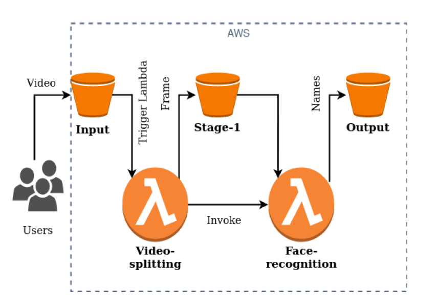

# Serverless Face Recognition System

A serverless face recognition system built using AWS Lambda, S3, and [facenet-pytorch](https://github.com/timesler/facenet-pytorch). The system processes user-uploaded videos, extracts frames, performs facial recognition, and stores results in a fully cloud-native pipeline.

## Architecture



1. **Users** upload a video to the **Input** S3 bucket.
2. The upload triggers the **Video-splitting Lambda**, which extracts frames and stores them in the **Stage-1** bucket.
3. Each frame is then processed by the **Face-recognition Lambda**, and the results are written to the **Output** bucket.

## Features

- Serverless pipeline using AWS Lambda and S3
- Face detection and recognition using facenet-pytorch
- Dockerized Lambda functions for portability
- Includes workload generator and automated grading scripts for testing

## Project Structure

lambda/
   handler.py # Lambda function code
   requirements.txt # Python dependencies
   Dockerfile # Lambda deployment container
   entry.sh # Entrypoint script
   data.pt # Face embeddings database
grader_script_p1.py # grading/utility scripts
workload_generator.py

## Quick Start

1. **Clone the repository**

   ```sh
   git clone https://github.com/yourusername/serverless-face-recognition.git
   cd serverless-face-recognition/Lambda2
   ```

2. **Install dependencies**

   ```sh
   pip install -r requirements.txt
   ```

3. **Run locally (for testing)**

   ```sh
   python handler.py
   ```

4. **Deploy to AWS Lambda**
   - Build the Docker images and push to AWS ECR.
   - Create Lambda functions using the image.
   - Set up S3 triggers.

---

> **Note:** This project was developed as part of coursework at Arizona State University.
